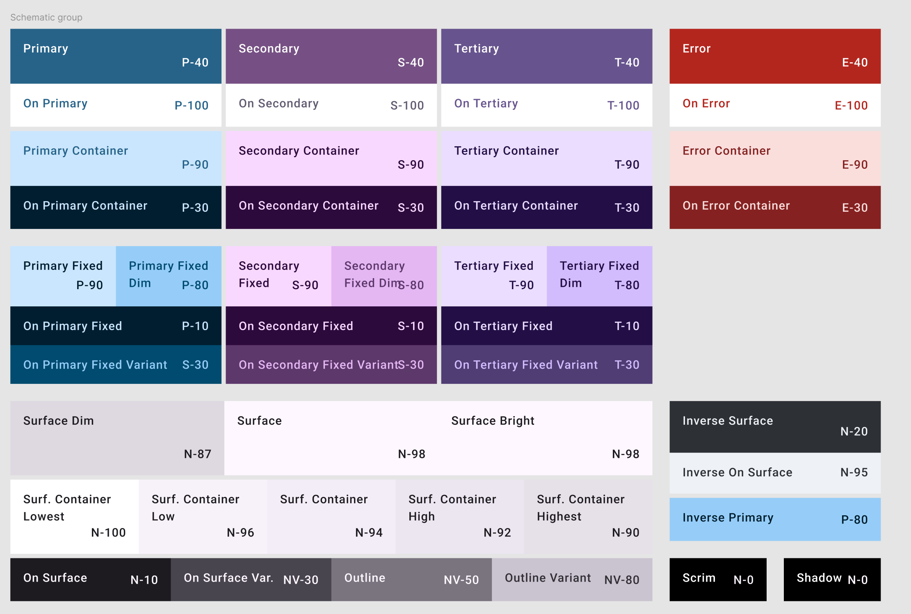
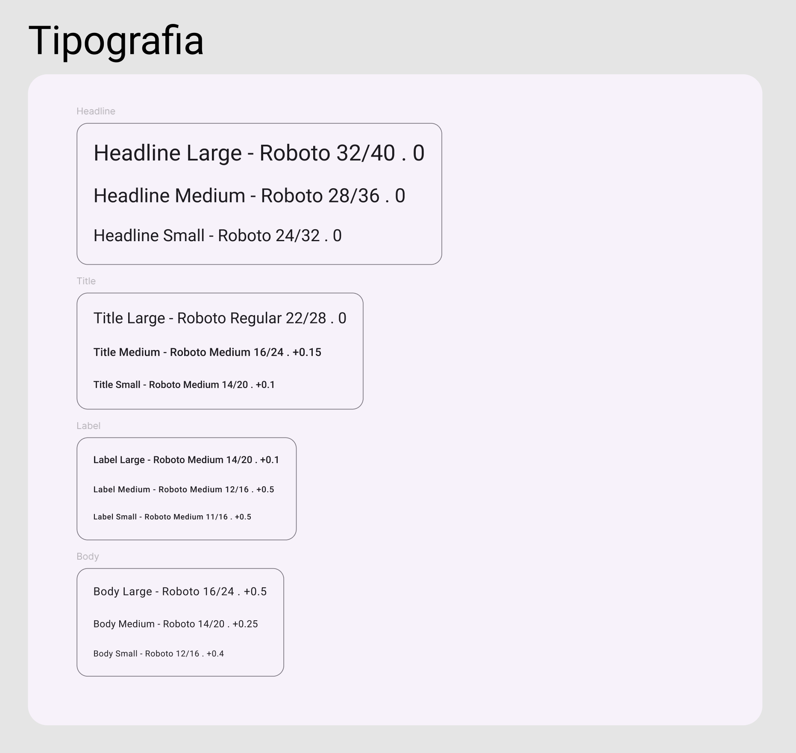

# Template padrão do site

Layout padrão do site (HTML e CSS) que será utilizado em todas as páginas com a definição de identidade visual, aspectos de responsividade e iconografia.

Escolhemos um designer mais simples e limpo, para facilitar a visão do usuário, Layout Mobile. As cores que transmitem calma e tranquilidade, justamente, o que propomos com o nosso projeto, Organizar e Colecionar.  

## Design

Nosso layout ficou assim na prática:

A Logo sera em cima, limpa, simples e organizada.
abaixo imagem da Logo:

## Cores

As cores escolhidas para a construção do layout foram baseadas no *Material design*.
Foram escolhidas três cores iniciais (Primaria: #005A84, secundária: #5C007F e terciária: #978CA9) e utilizado a ferramenta [Material theme builder](https://material-foundation.github.io/material-theme-builder/) gerar os shades das mesmas de acordo com os componentes presentes no Material design.
Ficou definido o uso do light theme como padrão para a aplicação.
Abaixo as cores e shades gerados para uso na aplicação:

## Tipografia

As fontes utilizadas no site serão padronizadas pelo próprio Material design de acordo com a imagem abaixo

## Iconografia
